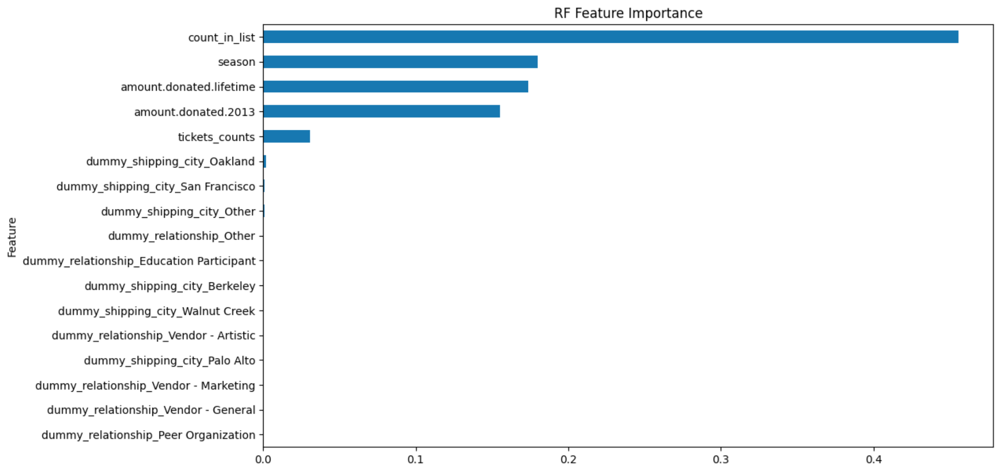

# Classical Music Meets Classical ML

*AIPI520 Kaggle Project*

This project's goal is to predict which previous patrons of the customer, an orchestra, will purchase a season subscription to the upcoming 2014-15 concert season.

## 1. Data Cleaning and Feature Extraction
For feature selection, I focused on the following features:
- **Number of Performers**: The `number_performers` function calculates the number of performers in the upcoming season who have appeared in past subscription seasons. This involves:
  - Cleaning data by replacing unexpected characters.
  - Extracting performer names using regular expressions.
  - Aggregating names to get a count of appearances for each account.
  
- **Tickets Dummy**: The `tickets_dummy` function creates one-hot encoded dummy variables for various features (e.g., price levels, number of seats) related to past ticket purchases.
  
- **Account Dummy**: The `account_dummy` function creates one-hot encoded dummy variables for features like shipping city and relationship from account information.

- **Subscription Counting**: The `sub_counting` function counts the number of subscriptions for each account.

By calculating the Random Forest Feature Importance, we can see that the Number of Performers gives us the most information gain, which is what I expected during feature selection. Following that, the number of subscriptions seasons and the amount of donations are the next most important features, which seems to make sense as well. The following graph shows the feature importance for the features:

## 2. Data Preparation
The `data_preparation` function integrates all the extracted features and prepares the datasets for training and validation:
- Join various datasets based on account ID.
- Fill missing values.
- Split the data into training and validation sets.

## 3. Model Training and Evaluation
We use the XGBoost algorithm for this task. The `model_training` function:
- Converts data into a format suitable for XGBoost.
- Defines parameters for the model.
- Trains the XGBoost model on the training data.
- Predicts on validation data and calculates the AUROC as a performance metric.

## 4. Predictions
The `predict` function:
- Merges the test dataset with the target feature set.
- Predicts the labels for the test data using the trained XGBoost model.
- Returns a dataframe with account IDs and their respective predictions.

## 5. Main Execution
The `main` function serves as the pipeline's starting point:
- Loads all the necessary datasets.
- Calls the data preparation function to preprocess the data.
- Trains the model using the training dataset.
- Predicts on the test dataset.

## Dataset Descriptions
- **train.csv**: Training data.
- **test.csv**: Test data for which we want to make predictions.
- **account.csv**: Contains account-related information.
- **tickets_all.csv**: Contains historical ticket purchase information.
- **subscriptions.csv**: Contains information about previously purchased subscriptions by account.
- **concerts.csv**: Lists previous concerts by season.
- **concerts_2014-15.csv**: Lists planned concert sets for the 2014-15 season.
- **zipcodes.csv**: Zipcode data (usage not shown in provided code).

To utilize this pipeline, run the `main` function after ensuring all the data files are present in the specified location.
